**UNIVERSIDADE FEDERAL DO AGRESTE DE PERNAMBUCO – UFAPE**

**BACHARELADO EM CIÊNCIA DA COMPUTAÇÃO**

**ALINE FERNANDA SOARES SILVA**
**CLAUDERSON BRANCO XAVIER**
**GUSTAVO FERREIRA WANDERLEY**
**VICTOR ALEXANDRE SARAIVA PIMENTEL**

**LabVida**
Laboratório de Análises Clínicas

**Entrega da 2ª VA referente à disciplina Sistemas de Informação e Tecnologias**
**Documentação Técnica e Analítica do Módulo de Business Intelligence**

**Garanhuns - PE**

**2026**

---

## SUMÁRIO

1. [Introdução e Objetivo do Módulo](#1-introdução-e-objetivo-do-módulo)
2. [Arquitetura do BI](#2-arquitetura-do-bi)
3. [Modelo Dimensional](#3-modelo-dimensional)
4. [Processo de ETL](#4-processo-de-etl)
5. [Camada Semântica de Métricas](#5-camada-semântica-de-métricas)
6. [Catálogo de Indicadores](#6-catálogo-de-indicadores)
7. [Dashboards](#7-dashboards)
8. [Análise Gerencial dos Indicadores](#8-análise-gerencial-dos-indicadores)
9. [Segurança, RBAC e LGPD no BI](#9-segurança-rbac-e-lgpd-no-bi)
10. [Decisões de Projeto e Trade-offs](#10-decisões-de-projeto-e-trade-offs)
11. [Limitações Conhecidas e Evolução Futura](#11-limitações-conhecidas-e-evolução-futura)

---

# 1. Introdução e Objetivo do Módulo

O módulo de Business Intelligence (BI) do LabVida é a camada analítica do ERP: consolida os dados gerados pelos módulos operacionais — Cadastro, Atendimento e Coleta, Logística de Amostras, Laboratorial, Faturamento de Convênios e Financeiro — em indicadores e dashboards gerenciais. Seu objetivo, conforme definido na regra de negócio geral do sistema (Entrega 1, §3.8), é permitir que a diretoria e os gestores de unidade tomem decisões operacionais e estratégicas com base em dados confiáveis, sem depender de consultas manuais ao banco operacional.

O BI está desacoplado do OLTP: possui um esquema dimensional próprio (*star schema*), alimentado por um processo de ETL (*Extract, Transform, Load*) que lê o banco operacional e grava em tabelas analíticas dedicadas, prefixadas por `bi_`. Essa separação garante que o BI seja **somente leitura** em relação aos dados de negócio — nenhuma tela do módulo escreve de volta no operacional — e que consultas analíticas pesadas não concorram com a operação do laboratório em tempo real.

O módulo teve uma reconstrução completa registrada em [`docs/plano-bi.md`](docs/plano-bi.md) (concluída em 02/08/2026, fase F2 do roadmap do projeto). Antes dela, o BI apresentava oito defeitos de dados catalogados — datas colapsadas em "hoje", valores de título em aberto contados como recebidos, séries temporais esparsas — e nenhum filtro de período. Esta documentação descreve o estado **atual** do código, já corrigido, e não o estado anterior à reconstrução.

# 2. Arquitetura do BI

## 2.1 Posição no ERP

O fluxo operacional do LabVida segue a cadeia Cadastro → Atendimento e Coleta → Logística → Laboratorial → Faturamento → Financeiro. O módulo de BI não participa dessa cadeia como etapa sequencial: ele é alimentado por todas as etapas, de forma assíncrona, através do ETL. A atualização dos dados do BI não é automática a cada transação operacional — ela ocorre sob demanda, disparada manualmente (ver §4.4).

## 2.2 Camadas de código

O módulo segue a mesma arquitetura vertical por domínio do restante do ERP, com uma separação adicional interna:

```
OLTP (banco operacional)
 │
 ├─→ src/bi/etl.py        extração e carga do star schema — idempotente, observável
 │
 ├─→ src/bi/models.py     star schema: 8 dimensões, 6 fatos, 1 tabela de execução
 │
 ├─→ src/bi/metricas.py   camada semântica — cada indicador é uma função tipada
 │
 ├─→ src/bi/graficos.py   especificações Altair reutilizáveis (tema, paleta, tooltip)
 │
 ├─→ src/bi/filtros.py    filtro de período e de dimensões, compartilhado pelas telas
 │
 └─→ pages/bi_*.py         6 páginas Streamlit — apenas orquestram: filtro → métrica → gráfico
```

A regra de arquitetura em vigor é que **nenhuma página de BI monta SQL diretamente**: toda consulta passa por uma função de `src/bi/metricas.py`. Isso é o que torna cada indicador testável sem subir o Streamlit — a suíte `tests/bi/` exercita `metricas.py` isoladamente — e evita que o mesmo indicador seja calculado de formas diferentes em duas telas.

## 2.3 Stack tecnológica

O BI reutiliza integralmente a stack do ERP, sem dependência adicional: **Python 3.12**, **PostgreSQL 16** como banco único (OLTP e OLAP nas mesmas instância e conexão, em tabelas separadas), **SQLAlchemy 2.0** para o modelo dimensional e as consultas, **pandas** para os `DataFrame`s intermediários, **Altair 6.2** para os gráficos e **Streamlit 1.60** para as telas. A camada de UI reaproveita os componentes visuais do restante do sistema (`src/ui.py`, `src/ui_components/`), incluindo o *shell* de autenticação e o menu lateral.

# 3. Modelo Dimensional

O BI é modelado como um esquema estrela clássico: dimensões descrevendo contexto (quem, o quê, onde, quando) e fatos aditivos guardando as medidas de cada evento de negócio. O diagrama abaixo (`docs/diagramas/bi-esquema-estrela.mmd`) reflete o modelo em vigor após a migration `0014_bi_reconstrucao`:

```mermaid
%% LabVida — Esquema Estrela do BI (modelo EM VIGOR, pos-fase F2)
%% Atualizado em 02/08/2026 · migration 0014_bi_reconstrucao
erDiagram

    DIM_TEMPO {
        int sk_tempo PK
        date data UK "calendario DENSO, dia a dia"
        int ano
        int mes
        int dia
        varchar dia_semana
        smallint dia_semana_num "0=segunda"
        smallint trimestre
        smallint semestre
        smallint semana_iso
        varchar nome_mes
        varchar ano_mes "2026-03"
        date competencia "1o dia do mes"
        boolean dia_util
    }

    DIM_UNIDADE {
        int sk_unidade PK
        uuid id_origem UK
        varchar nome
        varchar tipo "CENTRAL | COLETA"
    }

    DIM_SETOR {
        int sk_setor PK
        varchar chave_natural UK "nome normalizado"
        varchar nome
    }

    DIM_CONVENIO {
        int sk_convenio PK
        uuid id_origem UK
        varchar nome
        varchar registro_ans
    }

    DIM_PROCEDIMENTO {
        int sk_procedimento PK
        uuid id_origem UK
        varchar codigo_tuss
        varchar nome
        varchar setor
        int sk_setor FK
        boolean ativo
    }

    DIM_PACIENTE_ANON {
        int sk_paciente PK
        varchar id_origem UK "SHA-256 do UUID"
        varchar sexo
    }

    DIM_FAIXA_ETARIA {
        int sk_faixa_etaria PK
        varchar chave_natural UK
        varchar descricao
        smallint ordem
    }

    DIM_MOTIVO_GLOSA {
        int sk_motivo_glosa PK
        varchar chave_natural UK "motivo normalizado"
        varchar descricao
    }

    FATO_ORDEM_SERVICO {
        int sk_fato PK
        uuid ordem_servico_id UK "CHAVE NATURAL - grao: 1 OS"
        int sk_tempo FK
        int sk_unidade FK
        int sk_convenio FK
        int sk_paciente FK
        int sk_faixa_etaria FK
        int qtd_itens
        int qtd_itens_cancelados
        numeric valor_total
        numeric tempo_ciclo_horas "TAT coleta ate laudo"
        numeric tempo_coleta_recebimento_horas
        numeric tempo_recebimento_laudo_horas
        boolean concluida
    }

    FATO_ATENDIMENTO {
        int sk_fato PK
        uuid os_item_id UK "CHAVE NATURAL - grao: 1 item de OS"
        int sk_tempo FK
        int sk_unidade FK
        int sk_convenio FK
        int sk_procedimento FK
        int sk_paciente FK
        int sk_faixa_etaria FK
        int sk_setor FK
        int qtd_exames
        numeric valor_negociado
        boolean cancelado
        boolean laudo_liberado
    }

    FATO_FATURAMENTO {
        int sk_fato PK
        uuid guia_item_id UK "CHAVE NATURAL - grao: 1 item faturado"
        int sk_tempo FK "datado pelo FECHAMENTO do lote"
        int sk_unidade FK "unidade real da OS"
        int sk_convenio FK
        int sk_procedimento FK
        int sk_paciente FK
        int sk_setor FK
        numeric valor_faturado
        numeric valor_glosado
        numeric valor_liberado
        int qtd_itens
    }

    FATO_FINANCEIRO {
        int sk_fato PK
        varchar regime "PREVISTO | CAIXA"
        varchar origem_tabela
        uuid origem_id "CHAVE NATURAL composta com regime"
        int sk_tempo FK
        int sk_unidade FK
        int sk_convenio FK
        varchar fluxo "ENTRADA | SAIDA"
        numeric valor_previsto
        numeric valor_realizado
        boolean liquidado
    }

    FATO_LOGISTICA {
        int sk_fato PK
        uuid amostra_id UK "CHAVE NATURAL - grao: 1 amostra"
        int sk_tempo FK "datado pela COLETA"
        int sk_unidade FK
        int sk_unidade_destino FK
        int qtd_amostras
        numeric tempo_transito_horas "despacho ate recebimento"
        numeric tempo_coleta_recebimento_horas
        boolean rejeitada
        int amostras_divergentes
        varchar status_atual
    }

    FATO_GLOSA {
        int sk_fato PK
        uuid glosa_id UK "CHAVE NATURAL - grao: 1 glosa"
        int sk_tempo FK
        int sk_unidade FK
        int sk_convenio FK
        int sk_procedimento FK
        int sk_motivo_glosa FK
        numeric valor_glosado
        numeric valor_faturado_item
        int qtd_glosas
    }

    ETL_EXECUCAO {
        uuid id PK
        timestamptz iniciado_em
        timestamptz finalizado_em
        varchar status "EXECUTANDO | SUCESSO | ERRO"
        varchar modo "FULL | INCREMENTAL"
        jsonb linhas "contagem por fato"
        numeric duracao_seg
        text erro
    }

    DIM_TEMPO           ||--o{ FATO_ORDEM_SERVICO : "quando"
    DIM_UNIDADE         ||--o{ FATO_ORDEM_SERVICO : "onde"
    DIM_CONVENIO        ||--o{ FATO_ORDEM_SERVICO : "pagador"
    DIM_PACIENTE_ANON   ||--o{ FATO_ORDEM_SERVICO : "quem"
    DIM_FAIXA_ETARIA    ||--o{ FATO_ORDEM_SERVICO : "faixa congelada"

    DIM_TEMPO           ||--o{ FATO_ATENDIMENTO : "quando"
    DIM_UNIDADE         ||--o{ FATO_ATENDIMENTO : "onde"
    DIM_CONVENIO        ||--o{ FATO_ATENDIMENTO : "pagador"
    DIM_PROCEDIMENTO    ||--o{ FATO_ATENDIMENTO : "o que"
    DIM_PACIENTE_ANON   ||--o{ FATO_ATENDIMENTO : "quem"
    DIM_FAIXA_ETARIA    ||--o{ FATO_ATENDIMENTO : "faixa congelada"
    DIM_SETOR           ||--o{ FATO_ATENDIMENTO : "setor"

    DIM_TEMPO           ||--o{ FATO_FATURAMENTO : "quando"
    DIM_UNIDADE         ||--o{ FATO_FATURAMENTO : "onde"
    DIM_CONVENIO        ||--o{ FATO_FATURAMENTO : "pagador"
    DIM_PROCEDIMENTO    ||--o{ FATO_FATURAMENTO : "o que"
    DIM_PACIENTE_ANON   ||--o{ FATO_FATURAMENTO : "quem"
    DIM_SETOR           ||--o{ FATO_FATURAMENTO : "setor"

    DIM_TEMPO           ||--o{ FATO_FINANCEIRO : "quando"
    DIM_UNIDADE         ||--o{ FATO_FINANCEIRO : "onde"
    DIM_CONVENIO        ||--o{ FATO_FINANCEIRO : "pagador"

    DIM_TEMPO           ||--o{ FATO_LOGISTICA : "quando"
    DIM_UNIDADE         ||--o{ FATO_LOGISTICA : "origem e destino"

    DIM_TEMPO           ||--o{ FATO_GLOSA : "quando"
    DIM_UNIDADE         ||--o{ FATO_GLOSA : "onde"
    DIM_CONVENIO        ||--o{ FATO_GLOSA : "pagador"
    DIM_PROCEDIMENTO    ||--o{ FATO_GLOSA : "o que"
    DIM_MOTIVO_GLOSA    ||--o{ FATO_GLOSA : "por que"

    DIM_SETOR           ||--o{ DIM_PROCEDIMENTO : "classifica"
```



## 3.1 Dimensões

| Dimensão | Papel |
|---|---|
| `bi_dim_tempo` | Calendário **denso** — uma linha por dia, do menor ao maior evento registrado no operacional, fechando sempre o mês corrente inteiro. Isso evita que um mês sem movimento simplesmente desapareça de uma série temporal, o que aconteceria com um calendário criado sob demanda. |
| `bi_dim_unidade` | Unidades de coleta e o laboratório central, com o atributo `tipo`. |
| `bi_dim_setor` | Setor do laboratório, derivado do texto livre `Procedimento.setor` normalizado (*casefold* + *trim*) como chave natural. |
| `bi_dim_convenio` | Convênios cadastrados, incluindo o registro ANS. |
| `bi_dim_procedimento` | Procedimentos/exames, com código TUSS, setor e status ativo. |
| `bi_dim_paciente_anon` | Paciente **pseudonimizado**: a chave é o SHA-256 do UUID de origem, e o único atributo exposto é o sexo — ver §9.3. |
| `bi_dim_faixa_etaria` | Faixas etárias fixas (0-12, 13-18, 19-30, 31-50, 51-65, 66+, Desconhecida). |
| `bi_dim_motivo_glosa` | Motivo da glosa normalizado a partir do campo texto livre `Glosa.motivo`. |

## 3.2 Fatos

Cada fato do modelo declara explicitamente seu **grão** (o que uma linha representa) e carrega a **chave natural** — o identificador da linha de origem no OLTP — conforme a decisão de modelagem registrada na [ADR 0009](docs/adr/0009-grao-chave-natural-e-medidas-derivadas-no-bi.md).

| Fato | Grão | Chave natural | Principais medidas |
|---|---|---|---|
| `bi_fato_ordem_servico` | 1 Ordem de Serviço | `ordem_servico_id` | `tempo_ciclo_horas` (TAT coleta→laudo), `qtd_itens`, `qtd_itens_cancelados`, `valor_total`, `concluida` |
| `bi_fato_atendimento` | 1 item de OS (1 exame pedido) | `os_item_id` | `qtd_exames`, `valor_negociado`, `cancelado`, `laudo_liberado` |
| `bi_fato_faturamento` | 1 item de guia TISS faturado | `guia_item_id` | `valor_faturado`, `valor_glosado`, `valor_liberado`, `qtd_itens` |
| `bi_fato_financeiro` | 1 lançamento financeiro, por regime | `regime` + `origem_tabela` + `origem_id` | `valor_previsto`, `valor_realizado`, `fluxo` (ENTRADA/SAÍDA), `liquidado` |
| `bi_fato_logistica` | 1 amostra | `amostra_id` | `qtd_amostras`, `tempo_transito_horas`, `tempo_coleta_recebimento_horas`, `rejeitada` |
| `bi_fato_glosa` | 1 glosa | `glosa_id` | `valor_glosado`, `valor_faturado_item`, `qtd_glosas` |

Duas regras de modelagem regem o desenho dos fatos:

1. **Medida só convive com o fato que compartilha seu grão.** O tempo de ciclo da OS (TAT) é atributo da Ordem de Serviço, não do item — por isso vive em `bi_fato_ordem_servico`, e não repetido em cada linha de `bi_fato_atendimento`. Caso vivesse no fato de item, qualquer média ponderaria a OS pelo número de exames que ela contém, distorcendo o indicador.
2. **Medida derivada não é coluna.** Ticket médio, taxa de glosa e rentabilidade não existem como colunas gravadas — são calculadas em `src/bi/metricas.py` sobre as medidas aditivas (`valor_faturado`, `qtd_itens` etc.). Isso preserva a corretude sob qualquer recorte de período ou filtro: a média de médias não é a média, e uma razão pré-calculada não reagrega.

A carga é observada por `bi_etl_execucao`, uma tabela auxiliar que registra início, fim, status, modo (`FULL`), contagem de linhas por fato e duração de cada execução do ETL.

# 4. Processo de ETL

## 4.1 O que o ETL faz

`src/bi/etl.py` lê o banco operacional e popula o star schema em duas fases: primeiro as dimensões (`_carregar_dimensoes`), depois os fatos (`_carregar_fatos`), dentro de uma única transação. A carga de cada fato agrega os dados de origem em consultas SQL (sem laços linha a linha com múltiplas idas ao banco) e grava por meio de `INSERT ... ON CONFLICT DO UPDATE`, seguido de uma poda (`DELETE`) das linhas cuja chave natural desapareceu da origem.

## 4.2 Idempotência

O ETL não usa `date.today()` em nenhum ponto da carga de fatos — cada medida é datada pelo evento que a gera: a amostra pela data de coleta, o item faturado pelo fechamento do lote, o movimento de caixa por `ocorrido_em`. Combinado com o upsert por chave natural, isso garante que rodar o ETL duas vezes sobre os mesmos dados de origem produza exatamente as mesmas linhas — propriedade coberta por teste dedicado em `tests/bi/`.

## 4.3 Carga incremental

O parâmetro `modo` de `executar_etl()` aceita o valor `"FULL"`, que é o único modo efetivamente implementado e usado hoje — toda chamada ao ETL (seeder, CLI, botão nas telas) executa uma carga completa. A carga incremental, apoiada pela chave natural de cada fato e pelo registro em `bi_etl_execucao.finalizado_em`, está descrita em [`docs/plano-bi.md`](docs/plano-bi.md) como trabalho da Onda 2 (§11 do plano), ainda não implementado.

## 4.4 Como é disparado

O ETL não roda automaticamente a cada transação operacional. Ele é executado:

- pelo seeder da base de demonstração (`src/seeder/`), ao popular o ambiente;
- manualmente via linha de comando, `python -m src.bi.etl` (ou `docker compose exec app python -m src.bi.etl`);
- pelo botão **"Atualizar dados do BI"**, presente em cada dashboard (`src/bi/filtros.py:botao_atualizar`), que dispara `executar_etl()` sob demanda e recarrega a página.

## 4.5 Observabilidade

Cada execução gera uma linha em `bi_etl_execucao` com status (`EXECUTANDO`/`SUCESSO`/`ERRO`), duração e contagem de linhas por fato carregado. Todo dashboard exibe no rodapé, via `rodape_de_atualizacao()`, a data e hora da última carga bem-sucedida — sem isso, o usuário não teria como distinguir um número atualizado há minutos de um número de três semanas atrás.

## 4.6 Desempenho

As agregações (contagem, soma, mínimo/máximo de datas) são feitas no banco, uma consulta por fato, em vez de laços em Python que abririam múltiplas consultas por linha de origem. Na base de demonstração (~400 Ordens de Serviço), a carga completa leva cerca de 1,3 segundo.

# 5. Camada Semântica de Métricas

`src/bi/metricas.py` concentra toda a lógica de consulta do BI: cada indicador é uma função Python tipada que recebe uma sessão de banco, um objeto `Periodo` (início, fim, rótulo) e, opcionalmente, um `FiltroDimensoes` (unidade, convênio, procedimento), e devolve um `pandas.DataFrame` pronto para gráfico ou tabela.

Essa camada resolve três problemas que existiam antes da reconstrução do módulo: (i) nenhuma tela precisa escrever SQL — a página apenas chama a função e passa o resultado ao componente de gráfico; (ii) o filtro de período é aplicado de forma uniforme, por meio da função auxiliar `_no_periodo`, que junta o fato à `bi_dim_tempo` e restringe pela data; e (iii) o mesmo indicador nunca diverge entre duas telas, porque existe uma única implementação.

A classe `Periodo` também expõe o método `anterior()`, que devolve a janela imediatamente anterior de mesmo tamanho — usado pelas páginas para calcular a variação percentual (Δ%) de cada KPI frente ao período anterior, exibida no componente `st.metric` do Streamlit.

Duas famílias de indicadores não passam pelo esquema estrela: os de **Auditoria** (`auditoria_kpis`, `ocorrencias_por_mes`, `ocorrencias_por_acao`, `ocorrencias_por_entidade`, `ocorrencias_recentes`) consultam `AuditoriaLog` diretamente, e os de **Estoque** (`estoque_kpis`, `movimentacao_estoque_por_mes`, `insumos_maior_consumo`, `insumos_criticos`, `cobertura_dias`) consultam `InsumoMaterial`/`EstoqueMovimento` diretamente — ambas justificadas no próprio código como tabelas operacionais de baixo volume, sem "regime" ou estados sobrepostos que justifiquem replicá-las em um fato novo apenas para filtrar por período.

# 6. Catálogo de Indicadores

A tabela a seguir relaciona cada função de `src/bi/metricas.py` efetivamente usada por algum dashboard, sua definição de negócio, a fonte de dados de origem e onde ela aparece.

| Indicador | Definição de negócio | Fonte | Dashboard(s) |
|---|---|---|---|
| Exames (KPI) | Quantidade de itens de OS não cancelados no período | `bi_fato_atendimento` | Visão Executiva, Produtividade |
| Faturado / Glosado / Liberado (KPI) | Soma de `valor_faturado`, `valor_glosado` e (`faturado` − `glosado`) no período | `bi_fato_faturamento` | Visão Executiva, Financeiro |
| Recebido — regime de caixa (KPI) | Soma de `valor_realizado` de movimentos `ENTRADA` no regime `CAIXA` | `bi_fato_financeiro` | Visão Executiva, Financeiro |
| Taxa de glosa (KPI) | `glosado / faturado × 100` | `bi_fato_faturamento` | Visão Executiva, Financeiro |
| Ticket médio (KPI) | `faturado / exames` | `bi_fato_faturamento` + `bi_fato_atendimento` | Visão Executiva, Financeiro |
| TAT — tempo médio coleta→laudo (KPI e série) | Média de `tempo_ciclo_horas`, no grão da OS | `bi_fato_ordem_servico` | Visão Executiva, Produtividade |
| Taxa de rejeição de amostras (KPI) | `amostras rejeitadas / amostras × 100` | `bi_fato_logistica` | Visão Executiva, Logística |
| Exames por unidade / mês / convênio / faixa etária / setor | Volume de exames agrupado pela dimensão indicada | `bi_fato_atendimento` | Produtividade |
| Sazonalidade por dia da semana | Volume de exames por dia da semana (heatmap) | `bi_fato_atendimento` × `bi_dim_tempo` | Produtividade |
| TAT por mês / por setor | Média de `tempo_ciclo_horas`, agregada por competência ou por setor | `bi_fato_ordem_servico` (join a `bi_fato_atendimento`/`bi_dim_setor` para o recorte por setor) | Produtividade |
| Taxa de cancelamento de itens | `qtd_itens_cancelados / qtd_itens × 100`, no grão da OS | `bi_fato_ordem_servico` | Produtividade |
| Amostras por unidade / por mês | Volume de amostras coletadas, com contagem de rejeitadas | `bi_fato_logistica` | Logística |
| Tempo médio de trânsito de malote | Média de `tempo_transito_horas` (despacho → recebimento), por unidade | `bi_fato_logistica` | Logística |
| Tempo médio coleta→recebimento | Média de `tempo_coleta_recebimento_horas` | `bi_fato_logistica` | Logística |
| Situação atual das amostras | Contagem por `status_atual` do fato (não consulta a tabela operacional) | `bi_fato_logistica` | Logística |
| Receita por convênio / por mês | Soma de `valor_faturado`/`valor_glosado`/`valor_liberado`, agregada | `bi_fato_faturamento` | Financeiro |
| Ticket médio por convênio / por procedimento | `faturado / qtd_itens`, agregado pela dimensão | `bi_fato_faturamento` | Financeiro |
| Curva ABC de procedimentos | Receita por procedimento com participação acumulada e classe A/B/C (Pareto) | `bi_fato_faturamento` | Financeiro |
| Glosa por motivo | Soma de `valor_glosado` e ocorrências, por `bi_dim_motivo_glosa` | `bi_fato_glosa` | Financeiro |
| Taxa de glosa por convênio | `glosado / faturado × 100`, por convênio | `bi_fato_faturamento` | Financeiro, Visão Executiva |
| Fluxo de caixa realizado (mensal) | Entradas e saídas de `valor_realizado` no regime `CAIXA`, por mês, com saldo | `bi_fato_financeiro` | Financeiro |
| Previsto × recebido (mensal) | `valor_previsto` (regime PREVISTO, ENTRADA) contra `valor_realizado` (regime CAIXA, ENTRADA) | `bi_fato_financeiro` | Visão Executiva |
| Aging da carteira | Títulos a receber em aberto, por faixa de atraso (a vencer, 1-30, 31-60, 61-90, 90+ dias) | `bi_fato_financeiro` | Visão Executiva |
| DRE gerencial simplificado | Receita recebida − glosas do período − despesas pagas = Resultado, em regime de caixa | `bi_fato_financeiro` + `bi_fato_faturamento` | Visão Executiva |
| Alertas — títulos vencidos | Lista de títulos a receber/pagar vencidos e não liquidados, com dias de atraso | `titulos_receber`/`titulos_pagar` (operacional) | Visão Executiva |
| Alertas — malotes sem retorno | Malotes em trânsito há mais de N dias sem protocolo de recebimento | `malotes` (operacional) | Visão Executiva |
| Ocorrências de auditoria (KPI, série, por ação, por entidade, recentes) | Contagem de eventos do log de auditoria no período | `AuditoriaLog` (operacional) | Auditoria |
| Insumos críticos / cobertura de estoque (KPI) | Contagem de insumos abaixo do mínimo; dias de estoque restantes no ritmo de consumo do período | `InsumoMaterial`/`EstoqueMovimento` (operacional) | Estoque |
| Movimentação de estoque mensal | Entradas e saídas de insumo por mês | `EstoqueMovimento` (operacional) | Estoque |
| Insumos de maior consumo / insumos críticos (detalhe) | Ranking de saída no período; lista de insumos com saldo abaixo do mínimo | `InsumoMaterial`/`EstoqueMovimento` (operacional) | Estoque |

# 7. Dashboards

O módulo expõe seis páginas Streamlit em `pages/bi_*.py`, todas com filtro de período compartilhado (`seletor_de_periodo`) e rodapé indicando a última atualização do ETL. Cinco delas oferecem também o filtro combinável de Unidade/Convênio/Exame (`seletor_de_filtros`); a de Auditoria não, por consultar log de eventos sem essas dimensões.

## 7.1 Visão Executiva (`bi_visao_executiva.py`)

Pergunta de negócio: *como está a operação do laboratório, de forma consolidada, neste período?* Reúne um painel de alertas (títulos vencidos e malotes sem retorno, independente do filtro de período), seis KPIs de topo com variação percentual sobre o período anterior (exames, faturado, recebido, taxa de glosa, ticket médio, resultado do DRE), receita faturada por mês, previsto × recebido, DRE gerencial em regime de caixa, aging da carteira por faixa de atraso e taxa de glosa por convênio. Oferece filtro de período, Unidade e Convênio (sem filtro de Exame).

## 7.2 Produtividade Operacional (`bi_produtividade.py`)

Pergunta de negócio: *onde e quando o laboratório produz mais, e com que qualidade de ciclo?* Traz evolução mensal de exames, exames por unidade/convênio/setor/faixa etária, sazonalidade semanal (heatmap), TAT por setor e por mês, e a taxa de cancelamento de itens. Oferece filtro de período, Unidade, Convênio e Exame — com a ressalva, exibida na própria tela, de que o filtro de Exame não se aplica ao TAT nem à taxa de cancelamento, por serem indicadores no grão da OS inteira.

## 7.3 Indicadores Financeiros (`bi_financeiro.py`)

Pergunta de negócio: *quanto o laboratório fatura, quanto perde em glosa e quanto efetivamente recebe?* Reúne faturado × glosado por mês, receita e ticket médio por convênio, curva ABC de procedimentos, glosa por motivo, taxa de glosa por convênio, fluxo de caixa realizado (entradas × saídas) e uma tabela dos maiores tickets médios por procedimento.

## 7.4 Indicadores Logísticos (`bi_logistica.py`)

Pergunta de negócio: *a cadeia de custódia das amostras está eficiente e sem perdas?* Apresenta amostras coletadas por mês, amostras por unidade de origem, tempo médio de trânsito de malote, amostras rejeitadas por unidade e a situação atual das amostras (donut). Oferece filtro de período e Unidade (sem Convênio nem Exame, que não se aplicam a este fato).

## 7.5 Estoque (`bi_estoque.py`)

Pergunta de negócio: *o laboratório tem insumo suficiente, e o que está mais próximo de faltar?* Consulta diretamente as tabelas operacionais de estoque (não passa pelo ETL/esquema estrela). Mostra insumos críticos e cobertura de estoque em dias, movimentação mensal (entradas × saídas), insumos de maior consumo no período e uma grade dos insumos abaixo do mínimo. Oferece filtro de período e de insumo específico.

## 7.6 Auditoria (`bi_auditoria.py`)

Pergunta de negócio: *quem fez o quê no sistema, e quando?* Também consulta o log operacional diretamente. Apresenta o total de ocorrências no período com variação, evolução mensal, top ações e top entidades afetadas, e uma grade com as ocorrências recentes (usuário, ação, entidade, data/hora). É a única tela do módulo protegida por uma permissão distinta das demais (`admin:visualizar_auditoria` em vez de `bi:visualizar` — ver §9.1).

# 8. Análise Gerencial dos Indicadores

O conjunto de indicadores do BI sustenta decisão gerencial em três frentes concretas da operação do LabVida.

**Qualidade de ciclo e capacidade operacional.** O TAT (tempo entre coleta e liberação do laudo), medido corretamente no grão da Ordem de Serviço — e não mais distorcido por OS com muitos itens, como ocorria antes da correção do grão registrada na ADR 0009 —, é o indicador que mais diretamente traduz a percepção do paciente e do médico solicitante sobre a velocidade do laboratório. Cruzado com a distribuição de exames por setor e a sazonalidade semanal, ele permite ao gestor identificar não apenas *que* o ciclo está lento, mas *onde* (qual setor) e *quando* (qual dia da semana concentra a demanda), orientando decisões de escala de equipe e prioridade de bancada.

**Saúde financeira sob o regime correto.** A separação explícita entre regime **PREVISTO** (o que está no cronograma de vencimento de títulos) e regime **CAIXA** (o que de fato entrou ou saiu, via `MovimentoCaixa`) é o que torna o indicador "Recebido" e o "DRE gerencial" confiáveis para decisão — um título em aberto não é mais contabilizado como dinheiro recebido. Combinado com o aging da carteira por faixa de atraso e a taxa de glosa por convênio e por motivo, esse conjunto permite priorizar cobrança pelos títulos mais antigos e negociar com convênios que glosam mais, com o motivo específico da recusa em mãos — não apenas o valor perdido.

**Alocação de receita e portfólio de exames.** A curva ABC de procedimentos por receita identifica o pequeno grupo de exames (classe A) que concentra a maior parte do faturamento, informação relevante para negociação de preço com convênios e para decisão de investimento em equipamento/insumo. O ticket médio por convênio e por procedimento, calculado sempre a partir das medidas aditivas (nunca de uma razão pré-gravada — ADR 0009, decisão 3), permite comparar rentabilidade relativa entre convênios sem o viés de "média das médias".

Uma limitação importante para a leitura desses indicadores é que o `bi_fato_financeiro` aponta sempre para a unidade CENTRAL (caixa consolidado do laboratório), porque, hoje, um lote de faturamento fechado pode reunir itens de Ordens de Serviço de várias unidades de coleta diferentes — não há coluna de unidade em `lotes_faturamento`. Por isso, "Recebido", "Fluxo de caixa" e o "DRE gerencial" não podem ser lidos por unidade de coleta isoladamente; as próprias telas avisam o gestor disso quando um filtro de Unidade é aplicado (ver `bi_visao_executiva.py` e `bi_financeiro.py`).

# 9. Segurança, RBAC e LGPD no BI

## 9.1 Controle de acesso

O acesso às cinco páginas analíticas de negócio é controlado pela permissão `bi:visualizar`, verificada pela função `shell()` (`src/ui.py`) a cada carregamento de página — o mesmo mecanismo de RBAC (`Perfil → PerfilPermissao → Permissao`) usado no restante do ERP. A página de Auditoria usa uma permissão distinta e mais restrita, `admin:visualizar_auditoria`, coerente com a natureza mais sensível dos dados que exibe (quem fez o quê, quando). Ambas as permissões estão semeadas em `src/seeder/rbac.py`.

## 9.2 Modo somente leitura

Nenhuma tela do módulo de BI grava de volta no banco operacional. A única escrita realizada a partir de uma tela de BI é o disparo do próprio ETL (que lê o operacional e grava nas tabelas `bi_*`), acionado pelo botão "Atualizar dados do BI". Isso atende à regra de negócio #35 do sistema (visão *read-only* sobre a base operacional).

## 9.3 LGPD e anonimização

O paciente entra no BI pseudonimizado: `bi_dim_paciente_anon.id_origem` é o SHA-256 do UUID do paciente no operacional, não o identificador cru, e o único atributo de paciente exposto na dimensão é o sexo. A faixa etária — que poderia, combinada com outros filtros, aproximar a identificação de um paciente específico em bases pequenas — não é um atributo persistente da dimensão: ela é calculada na data de cada evento e gravada como um agregado congelado no próprio fato (`sk_faixa_etaria`), decisão 4 da ADR 0009. Nenhuma coluna do esquema estrela permite fazer *join* de volta à tabela `pacientes` do operacional a partir do BI.

# 10. Decisões de Projeto e Trade-offs

As quatro decisões de modelagem centrais do BI estão registradas e aceitas na [ADR 0009](docs/adr/0009-grao-chave-natural-e-medidas-derivadas-no-bi.md):

1. **Todo fato declara grão e carrega chave natural.** Sem isso, a única forma de recarregar o BI seria apagar e recarregar tudo a cada execução — o que o ETL atual não faz mais; a carga é feita por `INSERT ... ON CONFLICT DO UPDATE`.
2. **Medida no grão errado vira fato próprio.** Foi o caso do TAT, que motivou a criação de `bi_fato_ordem_servico` separado de `bi_fato_atendimento`.
3. **Medida derivada não é coluna.** Ticket médio, rentabilidade e taxa de glosa são funções de `metricas.py`, nunca colunas gravadas, para preservar a corretude sob reagregação.
4. **Atributo que muda com o tempo é congelado no fato.** A alternativa considerada — recalcular a faixa etária do paciente a cada carga — foi descartada porque faria um paciente que completa aniversário "desaparecer" retroativamente de relatórios de meses já fechados.

Outras decisões de trade-off registradas no plano do BI e na revisão final do módulo:

- **Drill-down interativo entre gráficos foi avaliado e descartado.** Chegou a existir um parâmetro de seleção em `barra_categorica` preparando um `alt.selection_point()` do Altair, mas nenhuma página o conectava. A equipe decidiu, em 17/08/2026, não implementar o cross-filter (esforço médio-alto, toca várias páginas) e removeu o código morto, em vez de deixá-lo pela metade.
- **`FatoFinanceiro` guarda dois regimes na mesma tabela**, distinguidos pela coluna `regime`, em vez de duas tabelas separadas — decisão deliberada porque o indicador mais pedido (previsto × realizado) ficaria com *join* desnecessário no modelo de duas tabelas.
- **Auditoria e Estoque não passam pelo esquema estrela.** Ambas as páginas consultam as tabelas operacionais diretamente, com a justificativa registrada no próprio código de que são tabelas de baixo volume, sem regime nem estados sobrepostos que justifiquem um fato dedicado apenas para habilitar filtro de período.

# 11. Limitações Conhecidas e Evolução Futura

O plano de reconstrução do BI ([`docs/plano-bi.md`](docs/plano-bi.md)) organiza o trabalho em duas ondas. A **Onda 1**, que corrigiu os oito defeitos de dados originais, introduziu o modelo com grão e chave natural, o ETL idempotente e observável, a camada semântica e os quatro dashboards originais com filtro de período, está **concluída** (02/08/2026) e é o que esta documentação descreve. A **Onda 2** depende de fases ainda não implementadas no restante do ERP — competência como eixo de apuração do faturamento, glosa com código TISS e recurso/recuperação, baixa parcial de títulos — e por isso continua pendente:

- **Carga incremental do ETL.** O parâmetro `modo` existe na assinatura de `executar_etl()`, mas apenas o modo `FULL` está implementado; a carga incremental (processar somente o que mudou desde a última execução) é trabalho futuro que a chave natural de cada fato já viabiliza.
- **Regime de competência no faturamento.** O BI hoje data o faturamento pelo fechamento do lote; a Onda 2 planeja migrar essa datação para a competência do item faturável, quando essa fase existir no faturamento.
- **`bi_fato_glosa` com código TISS.** A chave da `bi_dim_motivo_glosa` é hoje o texto livre normalizado de `Glosa.motivo`; duas descrições distintas do mesmo motivo (ex.: com e sem acentuação) podem gerar entradas separadas na dimensão até que o faturamento adote um código de glosa padronizado.
- **DRE gerencial com categorias de despesa** e **painel de divergências abertas** na Visão Executiva estão descritos no plano como evolução da Onda 2 e não existem no código hoje.
- **Indicador de consumo de insumos por setor**, prometido na Entrega 3 do projeto, foi avaliado e **decidido não implementar** nesta entrega: o fluxo de consumo de estoque em produção (`src/atendimento/amostra/service.py`) já soma as quantidades de insumo de todos os procedimentos de uma OS antes de gravar um único `EstoqueMovimento`, perdendo a granularidade por setor antes mesmo da persistência — corrigir isso exigiria alterar o fluxo operacional de consumo de estoque, não apenas o BI, e foi registrado como gap documentado (não implementado) em `docs/revisao-bi-final.md`.
- **`bi_fato_financeiro` sem unidade real de origem.** Como descrito em §8, o caixa é sempre consolidado na unidade central; atribuir cada lançamento financeiro à unidade de coleta correta exigiria mudança no modelo de faturamento (associar `lotes_faturamento` a uma unidade), fora do escopo do BI isoladamente.
