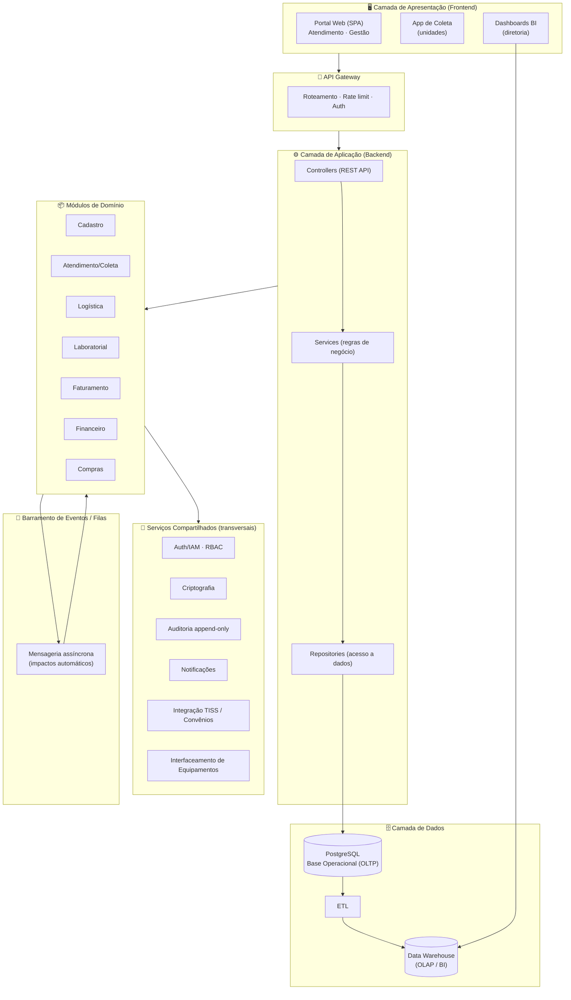
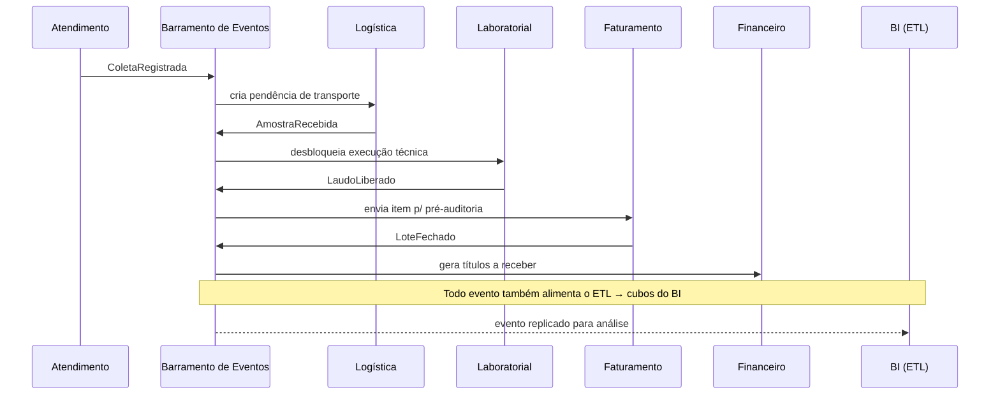
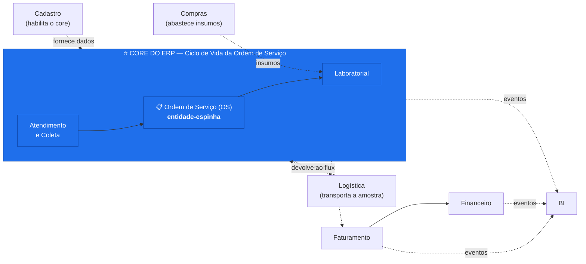
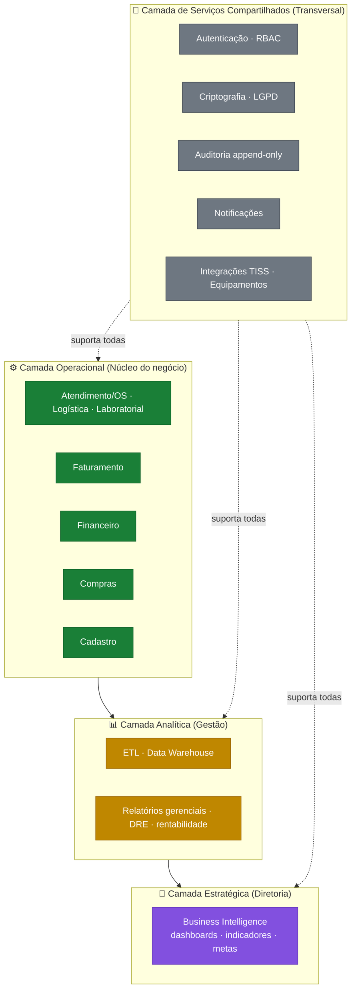
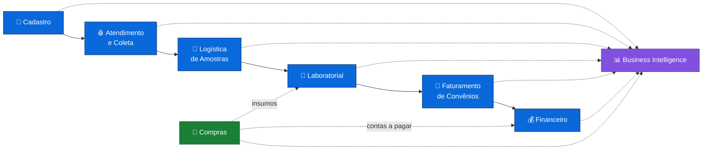

# Complemento da Entrega 01 — Arquitetura Técnica do ERP LabVida

**Disciplina:** Sistemas de Informação e Tecnologias (SIT)
**Projeto:** ERP LabVida — Laboratório de Análises Clínicas
**Equipe:** Aline Fernanda Soares Silva · Clauderson Branco Xavier · Gustavo Ferreira Wanderley · Victor Alexandre Saraiva Pimentel

> Este documento **complementa a 1ª Entrega**, atendendo aos pontos avaliados como *"Atendeu Parcialmente"*.
> A Entrega 01 cobriu com profundidade a **arquitetura organizacional** (módulos, fluxos, regras,
> integrações). Aqui detalhamos a **arquitetura técnica**: organização em camadas, stack tecnológica,
> destaque do módulo *core*, hierarquia arquitetural e a representação **visual** do sistema.

---

## Pontos atendidos por este complemento

| # | Critério (avaliação do professor) | Lacuna apontada | Seção que resolve |
|---|---|---|---|
| 1 | Arquitetura técnica do sistema | Faltou detalhamento explícito da arquitetura tecnológica completa | §1, §2 |
| 2 | Organização de código e camadas | Faltou backend, frontend, services, controllers, APIs, filas, camadas | §2, §3 |
| 3 | Clareza do módulo *core* | O núcleo operacional não foi destacado arquiteturalmente como "core do ERP" | §4 |
| 4 | Hierarquia arquitetural | Faltou divisão entre camadas operacionais, estratégicas, analíticas e serviços compartilhados | §5 |
| 5 | Estrutura visual do ERP | Faltou um diagrama visual completo | §6 (e diagramas §2, §4, §5) |

---

## 1. Visão geral da arquitetura tecnológica

O ERP LabVida adota uma **arquitetura em camadas (layered)** com **módulos de domínio** desacoplados,
combinada a um **barramento de eventos** que materializa os "impactos automáticos" descritos na Entrega 01.
A escolha responde diretamente aos problemas do diagnóstico organizacional:

| Decisão técnica | Problema do diagnóstico que resolve |
|---|---|
| Banco de dados relacional único e integrado | (b) Baixa integração entre sistemas; duplicidade de dados |
| Barramento de eventos / filas assíncronas | (d) Logística manual sem rastreamento em tempo real |
| API Gateway + serviços compartilhados | (c) Gargalos no atendimento (redigitação em vários sistemas) |
| Camada analítica (ETL + Data Warehouse) | (a) Gestão descentralizada; (f) Ausência de dashboards |
| Camada de segurança transversal (IAM, criptografia, auditoria) | (g) Riscos de segurança da informação |
| Integrações TISS e interfaceamento de equipamentos | (e) Faturamento crítico; processo laboratorial manual |

**Stack tecnológica de referência:**

| Camada | Tecnologias de referência |
|---|---|
| Frontend (Apresentação) | Aplicação web SPA (React/Angular) + app responsivo para coleta nas unidades |
| Backend (Aplicação) | API REST (Node.js/NestJS ou Java/Spring Boot), organizada em controllers → services → repositories |
| Mensageria / Eventos | Fila de mensagens (RabbitMQ/Kafka) para propagação assíncrona de eventos entre módulos |
| Persistência operacional | Banco relacional **PostgreSQL** (OLTP) |
| Persistência analítica | Data Warehouse + processo ETL para o módulo de BI (OLAP) |
| Integrações externas | APIs de convênios, padrão **TISS** (XML), interfaceamento HL7/ASTM com analisadores clínicos |
| Segurança | IAM/Auth (JWT + RBAC), criptografia de dados sensíveis, logs de auditoria append-only |

---

## 2. Arquitetura em camadas (organização de código)

A organização lógica do sistema separa responsabilidades técnicas em camadas bem definidas. Cada
requisição percorre as camadas de cima para baixo; os eventos automáticos trafegam pelo barramento.

**Leitura da camada de aplicação (padrão por módulo):**
- **Controller** — expõe os endpoints REST, valida entrada, traduz HTTP ↔ domínio.
- **Service** — concentra as **regras de negócio** da Entrega 01 (ex.: "não faturar OS sem laudo liberado").
- **Repository** — isola o acesso ao PostgreSQL, garantindo que regras não conheçam detalhes de SQL.
- **Eventos** — após uma operação, o service publica um evento na fila; outros módulos reagem (assíncrono).

---

## 3. Comunicação assíncrona — os "impactos automáticos" como eventos

A Seção 5 da Entrega 01 ("Impactos Automáticos das Operações") é implementada tecnicamente via
**barramento de eventos**. Cada gatilho organizacional vira uma mensagem publicada/consumida:

Esse desacoplamento por eventos é o que garante baixo acoplamento entre módulos (justificativa
arquitetural da Entrega 01) e resolve a logística manual sem rastreamento em tempo real.

---

## 4. Módulo *core* do ERP (núcleo operacional)

O **core do ERP LabVida** é o eixo **Atendimento → Ordem de Serviço (OS) → Laboratorial**, organizado
em torno da **Ordem de Serviço como entidade-espinha** que atravessa todo o ciclo de vida operacional.
Todos os demais módulos orbitam e dependem desse núcleo.

**Por que esse é o core:**
- É onde a **OS nasce, percorre seu ciclo de vida e gera o laudo** — o produto final do laboratório.
- Sem ele, nenhum outro módulo tem o que processar: Faturamento depende do laudo, Financeiro depende do faturamento, BI depende de todos os eventos gerados aqui.
- Concentra as **regras de negócio mais críticas** (clínicas e de rastreabilidade): identificador único da OS, vínculo amostra↔OS, liberação de laudo por responsável técnico, auditoria imutável de resultados.
- Cadastro é **pré-condição** (habilita), Compras é **suporte** (abastece), e Faturamento/Financeiro/BI são **consumidores a jusante** do que o core produz.

---

## 5. Hierarquia arquitetural (camadas estratégicas)

Os módulos do ERP se organizam em uma **hierarquia de quatro camadas**, conforme seu papel na operação
e na tomada de decisão — do chão de operação até a estratégia da diretoria.

| Camada | Papel | Módulos / componentes |
|---|---|---|
| **Estratégica** | Decisão da diretoria baseada em dados | BI (dashboards, metas, preditivos) |
| **Analítica** | Consolidação e geração de indicadores | ETL, Data Warehouse, relatórios gerenciais, DRE |
| **Operacional** | Execução do dia a dia do laboratório | Cadastro, Atendimento/OS, Logística, Laboratorial, Faturamento, Financeiro, Compras |
| **Serviços Compartilhados** | Recursos transversais reutilizáveis | Auth/RBAC, criptografia, auditoria, notificações, integrações |

A camada analítica é **alimentada** pela operacional (sem interferir nela — BI é *read-only*, respeitando
a regra da Entrega 01), e a camada de serviços compartilhados **atravessa** todas as demais.

---

## 6. Estrutura visual completa do ERP

Diagrama macro que substitui a descrição puramente textual da Seção 2 da Entrega 01, mostrando os
módulos, o fluxo central e a alimentação do BI por todas as operações.

**Legenda:** linha cheia = fluxo operacional principal (ciclo da OS); linha tracejada = alimentação do BI
e suporte de Compras. O BI é alimentado por **todos** os módulos, conforme a Entrega 01.

---

## 7. Síntese

Com este complemento, a Entrega 01 passa a apresentar — além da já consolidada arquitetura
organizacional — a **arquitetura técnica completa**: organização em camadas (frontend, backend com
controllers/services/repositories, mensageria, dados), stack tecnológica explícita, comunicação
assíncrona por eventos, destaque do **core** operacional (ciclo da OS), **hierarquia arquitetural** em
quatro camadas e a **representação visual** do sistema por diagramas. Esses elementos servem de base
direta para a Entrega 02 (modelagem da base de dados), onde a camada de dados aqui descrita é detalhada.
