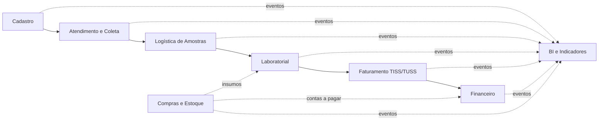

# Entrega 03 - Integração Organizacional do ERP LabVida

**Disciplina:** Sistemas de Informação e Tecnologias (SIT)  
**Projeto:** ERP LabVida - Laboratório de Análises Clínicas  
**Equipe:** Aline Fernanda Soares Silva · Clauderson Branco Xavier · Gustavo Ferreira Wanderley · Victor Alexandre Saraiva Pimentel  
**Garanhuns - PE · 2026**

---

## 1. Visão Geral da Integração

O ERP LabVida é organizado em módulos especializados, mas integrados por um fluxo operacional comum. A **Ordem de Serviço (OS)** é a entidade central do processo, pois nasce no atendimento, acompanha os exames solicitados, vincula as amostras coletadas, conecta-se ao laudo laboratorial e habilita o faturamento.



Esse fluxo demonstra que cada setor possui uma responsabilidade própria, mas nenhum opera isoladamente. O cadastro fornece dados confiáveis para o atendimento; o atendimento gera a OS; a coleta gera amostras rastreáveis; a logística garante a cadeia de custódia; o laboratório produz resultados e laudos; o faturamento transforma laudos liberados em guias TISS; o financeiro acompanha os recebimentos; e o BI consolida os eventos para apoiar a gestão.

---

## 2. Módulos e Responsabilidades Integradas

| Módulo | Responsabilidade principal | Informações que recebe | Informações que produz |
|---|---|---|---|
| Cadastro | Manter dados de pacientes, médicos, convênios, procedimentos, unidades e setores | Dados administrativos e contratuais | Base única para atendimento, faturamento e BI |
| Atendimento e Coleta | Abrir OS, validar convênio, registrar exames solicitados e coletar amostras | Paciente, médico, convênio, procedimento e unidade | OS, itens de OS, autorização, amostra e evento de coleta |
| Logística de Amostras | Transportar amostras entre unidades e laboratório central | Amostras coletadas e unidade de origem | Malote, movimentações e protocolo de recebimento |
| Laboratorial | Processar exames, importar resultados, revisar e liberar laudos | Amostras recebidas, OS e procedimentos | Resultado, revisão técnica e laudo liberado |
| Faturamento | Gerar guias, lotes, XML TISS e controlar glosas | Laudos liberados, convênio, TUSS e valores contratados | Guia TISS, guia item, lote de faturamento e glosa |
| Financeiro | Controlar contas a receber, contas a pagar, caixa e conciliação | Lotes fechados, compras aprovadas e pagamentos | Títulos, movimentos financeiros e divergências |
| Compras e Estoque | Comprar, receber e controlar insumos laboratoriais | Demandas internas e fornecedores | Pedido de compra, entrada de estoque e título a pagar |
| Auditoria | Registrar eventos sensíveis e ações dos usuários | Alterações operacionais e acessos | Trilha de auditoria corporativa |
| BI | Consolidar dados para decisão gerencial | Eventos de todos os módulos | Indicadores, dashboards e relatórios gerenciais |

---

## 3. Comunicação Entre Módulos

A comunicação entre os módulos ocorre por meio de uma base relacional integrada e por eventos operacionais. A base de dados garante a unicidade e a consistência das informações; os eventos representam os impactos automáticos que fazem um setor reagir a uma ação realizada em outro.

| Evento operacional | Módulo de origem | Módulo impactado | Efeito organizacional |
|---|---|---|---|
| Paciente cadastrado | Cadastro | Atendimento | Paciente fica disponível para abertura de OS |
| OS aberta | Atendimento | Coleta, Faturamento, BI | Exames passam a existir como demanda operacional e futura cobrança |
| Convênio validado | Atendimento | Faturamento | Guia/autorização passa a compor o processo TISS |
| Coleta registrada | Coleta | Logística | Amostra gera pendência de transporte e rastreamento |
| Amostra enviada em malote | Logística | Laboratorial | Laboratório central recebe previsão de processamento |
| Amostra recebida e conferida | Logística | Laboratorial | Exame é liberado para execução técnica |
| Resultado importado | Laboratorial | Revisão técnica, Auditoria | Resultado fica pendente de validação e auditável |
| Laudo liberado | Laboratorial | Faturamento | Item faturável é criado ou habilitado para pré-auditoria TISS/TUSS |
| Lote de faturamento fechado | Faturamento | Financeiro | Título a receber é gerado automaticamente |
| Pagamento conciliado | Financeiro | BI, Gestão | Receita, divergências e inadimplência são atualizadas |
| Compra aprovada | Compras | Financeiro, Estoque | Gera previsão de pagamento e acompanhamento de recebimento |
| Insumo recebido | Compras/Estoque | Laboratorial, BI | Estoque é atualizado e disponibilidade operacional aumenta |

Essa comunicação evita redigitação, reduz inconsistências e substitui controles paralelos por uma cadeia única de informação.

---

## 4. Fluxo Ponta a Ponta da Informação

O fluxo principal do ERP LabVida acompanha a jornada de um exame desde a chegada do paciente até a entrada financeira e a geração de indicadores.

### 4.1 Entrada da informação

O processo inicia no **Cadastro** e no **Atendimento**. O paciente, o médico solicitante, o convênio, o plano, a unidade e os procedimentos são selecionados a partir de cadastros previamente controlados. Com isso, a OS não é preenchida com texto livre: ela referencia dados únicos e padronizados.

Entidades envolvidas:

- Pessoa/Paciente.
- Profissional de Saúde/Médico solicitante.
- Convênio e plano.
- Procedimento com código TUSS.
- Unidade de atendimento.
- Ordem de Serviço e itens da OS.

### 4.2 Processamento operacional

A OS gera amostras identificadas por código de barras ou QR Code. A coleta registra quem coletou, quando coletou e a qual OS a amostra pertence. Em seguida, a logística organiza o transporte por malotes e registra cada movimentação da amostra até o recebimento no laboratório central.

Entidades envolvidas:

- Amostra.
- Coleta.
- Malote.
- Malote-amostra.
- Amostra movimentação.
- Protocolo de recebimento.

### 4.3 Processamento técnico

Quando a amostra é recebida e conferida, o módulo laboratorial pode executar o exame. O resultado pode ser importado de equipamentos laboratoriais ou registrado por usuário autorizado. Depois, passa por revisão técnica e é consolidado em laudo. O laudo só pode ser liberado por responsável técnico habilitado.

Entidades envolvidas:

- Equipamento.
- Resultado.
- Resultado revisão.
- Resultado auditoria.
- Laudo.
- Responsável técnico.

### 4.4 Processamento administrativo e financeiro

A liberação do laudo gera impacto direto no faturamento. O sistema identifica o procedimento, o convênio, o código TUSS e o valor contratado, criando ou habilitando o item de guia TISS. Após a pré-auditoria e o fechamento do lote de faturamento, o financeiro recebe automaticamente o título a receber.

Entidades envolvidas:

- Guia TISS.
- Guia item.
- Lote de faturamento.
- Glosa.
- Título a receber.
- Movimento financeiro.
- Conciliação de pagamento.

### 4.5 Processamento analítico

Os eventos registrados ao longo do processo alimentam a camada de BI por ETL. A gestão passa a visualizar indicadores como produtividade por unidade, tempo médio entre coleta e laudo, taxa de glosa por convênio, receita por procedimento, divergências financeiras e consumo de insumos.

Entidades e estruturas envolvidas:

- Fato atendimento.
- Fato logística.
- Fato laboratorial.
- Fato faturamento.
- Fato financeiro.
- Dimensões de tempo, unidade, convênio, procedimento e paciente anonimizado.

---

## 5. Impacto das Operações Entre Setores

A principal evidência de integração organizacional é que uma ação em um setor muda automaticamente a situação de outros setores.

### 5.1 Exemplo 1: Registro de coleta

Quando o setor de coleta registra uma amostra:

| Etapa | Impacto |
|---|---|
| Coleta registra amostra vinculada a OS | A amostra passa ao status `COLETADA` |
| Sistema cria movimentação da amostra | A cadeia de custódia passa a existir |
| Logística recebe pendência de transporte | A amostra deve ser incluída em malote |
| BI recebe evento operacional | Indicadores de volume de coleta e produtividade são atualizados |
| Auditoria registra usuário, data e ação | A operação fica rastreável |

### 5.2 Exemplo 2: Recebimento de amostra no laboratório central

Quando a logística registra o recebimento:

| Etapa | Impacto |
|---|---|
| Malote é conferido | Integridade da amostra é validada |
| Amostra passa ao status `RECEBIDA` | Laboratório pode iniciar processamento |
| Protocolo de recebimento é salvo | Cadeia de custódia é completada para aquela etapa |
| Laboratorial recebe demanda técnica | Resultado pode ser produzido ou importado |
| BI mede tempo de transporte | Indicador logístico é atualizado |

### 5.3 Exemplo 3: Liberação de laudo

Quando o responsável técnico libera um laudo:

| Etapa | Impacto |
|---|---|
| Laudo muda para `LIBERADO` | Resultado fica disponível como produto técnico final |
| Auditoria registra responsável técnico e assinatura | Responsabilidade técnica é comprovada |
| Faturamento recebe item elegível | Guia TISS/TUSS pode ser gerada ou pré-auditada |
| BI atualiza tempo coleta-laudo | Indicador de eficiência laboratorial é recalculado |
| Paciente/solicitante pode acessar laudo conforme regra | Atendimento conclui a demanda assistencial |

### 5.4 Exemplo 4: Fechamento de lote de faturamento

Quando o faturamento fecha um lote:

| Etapa | Impacto |
|---|---|
| Lote muda para `FECHADO` | Itens faturados ficam consolidados |
| XML TISS e guias são preparados | Envio ao convênio fica padronizado |
| Financeiro recebe título a receber | Receita prevista passa a compor o contas a receber |
| BI atualiza receita e glosas | Gestão acompanha desempenho por convênio |

---

## 6. Rastreabilidade Organizacional

A rastreabilidade no ERP LabVida permite reconstruir o caminho da informação e identificar quem realizou cada ação, quando ela ocorreu e qual entidade foi afetada.

| Objeto rastreado | Como é rastreado | Finalidade |
|---|---|---|
| Ordem de Serviço | Código único da OS e histórico de status | Acompanhar o ciclo completo do atendimento |
| Amostra | Código de barras/QR e movimentações | Garantir cadeia de custódia |
| Malote | Origem, destino, responsável e recebimento | Controlar transporte entre unidades |
| Resultado | Status, equipamento, revisor e auditoria de alterações | Preservar confiabilidade técnica |
| Laudo | Responsável técnico, assinatura digital e data de liberação | Comprovar validade clínica |
| Guia TISS | Número, lote, procedimento e laudo associado | Rastrear cobrança ao convênio |
| Título financeiro | Lote de origem, valor, vencimento e baixa | Rastrear receita ou obrigação financeira |
| Auditoria corporativa | Usuário, entidade, ação, data/hora e dados alterados | Atender governança, LGPD e controle interno |

Exemplo de rastreamento completo:

```text
Paciente -> OS -> Item da OS -> Amostra -> Coleta -> Malote -> Recebimento -> Resultado -> Laudo -> Guia TISS -> Lote -> Título a Receber -> Conciliação -> BI
```

Com esse encadeamento, a LabVida consegue responder perguntas gerenciais e operacionais como:

- Qual unidade abriu a OS?
- Quem coletou a amostra?
- Em qual malote a amostra foi transportada?
- Quando a amostra chegou ao laboratório central?
- Qual equipamento produziu o resultado?
- Quem revisou e liberou o laudo?
- Qual guia TISS cobrou o exame?
- O convênio pagou integralmente ou houve glosa?

---

## 7. Circulação dos Dados

A circulação dos dados no ERP segue uma cadeia controlada de entrada, validação, processamento, consolidação e análise.

| Fase | Dados principais | Módulo responsável | Resultado |
|---|---|---|---|
| Entrada cadastral | Paciente, médico, convênio, procedimento, unidade | Cadastro | Dados padronizados e reutilizáveis |
| Solicitação | OS, itens da OS, autorização | Atendimento | Demanda formal de exames |
| Identificação física | Amostra, etiqueta, coletor | Coleta | Material biológico vinculado a OS |
| Transporte | Malote, movimentações, recebimento | Logística | Cadeia de custódia documentada |
| Análise | Resultado, equipamento, valores de referência | Laboratorial | Resultado técnico validável |
| Validação | Revisão, laudo, assinatura | Laboratorial | Laudo liberado |
| Cobrança | Guia TISS, guia item, lote | Faturamento | Receita faturada por convênio |
| Controle econômico | Título, baixa, conciliação | Financeiro | Receita recebida ou pendente |
| Análise gerencial | Fatos, dimensões, indicadores | BI | Apoio à decisão estratégica |

Essa circulação evita que cada setor tenha seu próprio cadastro, sua própria planilha ou sua própria versão da verdade. O dado nasce uma vez, e os demais módulos o consomem conforme sua responsabilidade.

---

## 8. Regras de Negócio que Moldam a Integração

As regras de negócio definem os limites e os impactos das operações dentro do ERP. Elas garantem que o fluxo integrado seja consistente com as diretrizes da LabVida.

| Regra de negócio | Módulos envolvidos | Impacto no processo |
|---|---|---|
| Paciente deve ter identificação única | Cadastro, Atendimento | Evita duplicidade de OS e inconsistência histórica |
| Convênio deve estar ativo para autorizar OS | Cadastro, Atendimento, Faturamento | Impede atendimento conveniado sem elegibilidade |
| Procedimento deve existir no catálogo TUSS | Cadastro, Atendimento, Faturamento | Garante cobrança padronizada em TISS/TUSS |
| OS deve possuir código único | Atendimento, Coleta, Laboratório, Faturamento | Permite rastrear todo o ciclo operacional |
| Amostra deve estar vinculada a uma OS | Coleta, Logística, Laboratório | Evita amostra sem origem identificada |
| Amostra só pode ser processada após recebimento | Logística, Laboratório | Protege a cadeia de custódia |
| Resultado alterado deve gerar auditoria | Laboratório, Auditoria | Impede perda de histórico clínico |
| Laudo só pode ser liberado por responsável técnico | Laboratório, Auditoria | Garante responsabilidade técnica |
| Laudo liberado habilita faturamento | Laboratório, Faturamento | Impede cobrança antes da conclusão técnica |
| Lote fechado gera título a receber | Faturamento, Financeiro | Integra cobrança e controle financeiro |
| Compra aprovada gera título a pagar | Compras, Financeiro | Integra suprimentos e contas a pagar |
| Dados sensíveis devem ser protegidos | Todos, Auditoria, BI | Atende LGPD e reduz risco de vazamento |
| BI deve usar dados anonimizados de pacientes | BI, Cadastro, Atendimento | Permite análise sem exposição indevida |

---

## 9. Consistência e Unicidade dos Dados

A integração organizacional depende de uma base única de dados. Por isso, o ERP LabVida evita que setores diferentes mantenham informações duplicadas ou divergentes.

Princípios adotados:

- A OS é a entidade-espinha do fluxo operacional.
- O paciente, o convênio, o procedimento e a unidade são referenciados por identificadores únicos.
- O código TUSS padroniza os procedimentos faturáveis.
- A amostra possui identificador próprio, mas sempre vinculado a uma OS.
- O laudo se conecta ao item da OS e ao responsável técnico.
- A guia TISS referencia o laudo liberado, evitando cobrança indevida.
- O título a receber referencia o lote de faturamento, garantindo origem financeira clara.
- A auditoria registra alterações sensíveis sem sobrescrever histórico.
- O BI consome dados consolidados, sem alterar a base operacional.

Com isso, o sistema assegura uma única versão da verdade para os setores da LabVida.

---

## 10. Cenário Integrado Demonstrativo

Para demonstrar a integração, considere o seguinte cenário:

1. Um paciente chega a uma unidade de coleta da LabVida.
2. O atendente localiza ou cadastra o paciente, seleciona o médico solicitante, o convênio e os procedimentos.
3. O sistema valida se o convênio está ativo e se os procedimentos possuem código TUSS.
4. A OS é aberta e passa a concentrar os exames solicitados.
5. A coleta identifica a amostra com código de barras e registra o coletor.
6. A logística inclui a amostra em um malote para o laboratório central.
7. O laboratório central recebe o malote, confere a integridade e libera a amostra para análise.
8. O equipamento laboratorial gera o resultado, que passa por revisão técnica.
9. O responsável técnico libera o laudo com assinatura digital.
10. A liberação do laudo cria uma pendência no faturamento para pré-auditoria TISS/TUSS.
11. O faturamento gera a guia TISS, agrupa os itens em lote e fecha a cobrança.
12. O fechamento do lote gera automaticamente um título a receber no financeiro.
13. O pagamento do convênio é conciliado; se houver divergência, registra-se glosa.
14. Todos os eventos alimentam o BI, gerando indicadores de tempo de atendimento, produtividade, glosa, receita e desempenho por unidade.

Esse cenário mostra que uma informação registrada no início do processo continua sendo aproveitada e enriquecida pelos demais setores, sem redigitação e sem perda de rastreabilidade.

---

## 11. Indicadores Gerenciais Gerados Pela Integração

A integração dos módulos permite que a diretoria acompanhe indicadores que não seriam confiáveis em um sistema fragmentado.

| Indicador | Dados de origem | Utilidade gerencial |
|---|---|---|
| Tempo médio entre coleta e laudo | Coleta, movimentação de amostra, resultado e laudo | Avaliar eficiência operacional |
| Produtividade por unidade | OS, coletas e laudos | Comparar desempenho entre unidades |
| Taxa de glosa por convênio | Guia TISS, guia item e glosa | Melhorar contratos e reduzir perdas |
| Receita por procedimento | Procedimento, guia item e título a receber | Avaliar rentabilidade de exames |
| Inadimplência e divergências | Título a receber e conciliação | Apoiar controle financeiro |
| Consumo de insumos por setor | Estoque, compras e laboratório | Planejar compras e evitar ruptura |
| Volume de exames por período | OS item, procedimento e tempo | Prever demanda e escala de equipes |
| Ocorrências de auditoria | Auditoria corporativa e usuários | Monitorar riscos e conformidade |
