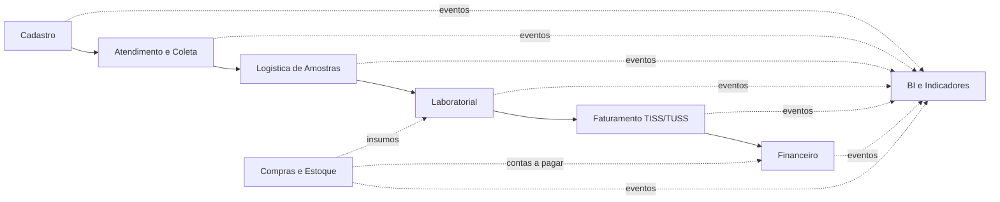

# Entrega 03 - Integracao Organizacional do ERP LabVida

**Disciplina:** Sistemas de Informacao e Tecnologias (SIT)  
**Projeto:** ERP LabVida - Laboratorio de Analises Clinicas  
**Equipe:** Aline Fernanda Soares Silva · Clauderson Branco Xavier · Gustavo Ferreira Wanderley · Victor Alexandre Saraiva Pimentel  
**Garanhuns - PE · 2026**

---

## 1. Visao Geral da Integracao

O ERP LabVida e organizado em modulos especializados, mas integrados por um fluxo operacional comum. A **Ordem de Servico (OS)** e a entidade central do processo, pois nasce no atendimento, acompanha os exames solicitados, vincula as amostras coletadas, conecta-se ao laudo laboratorial e habilita o faturamento.



Esse fluxo demonstra que cada setor possui uma responsabilidade propria, mas nenhum opera isoladamente. O cadastro fornece dados confiaveis para o atendimento; o atendimento gera a OS; a coleta gera amostras rastreaveis; a logistica garante a cadeia de custodia; o laboratorio produz resultados e laudos; o faturamento transforma laudos liberados em guias TISS; o financeiro acompanha os recebimentos; e o BI consolida os eventos para apoiar a gestao.

---

## 2. Modulos e Responsabilidades Integradas

| Modulo | Responsabilidade principal | Informacoes que recebe | Informacoes que produz |
|---|---|---|---|
| Cadastro | Manter dados de pacientes, medicos, convenios, procedimentos, unidades e setores | Dados administrativos e contratuais | Base unica para atendimento, faturamento e BI |
| Atendimento e Coleta | Abrir OS, validar convenio, registrar exames solicitados e coletar amostras | Paciente, medico, convenio, procedimento e unidade | OS, itens de OS, autorizacao, amostra e evento de coleta |
| Logistica de Amostras | Transportar amostras entre unidades e laboratorio central | Amostras coletadas e unidade de origem | Malote, movimentacoes e protocolo de recebimento |
| Laboratorial | Processar exames, importar resultados, revisar e liberar laudos | Amostras recebidas, OS e procedimentos | Resultado, revisao tecnica e laudo liberado |
| Faturamento | Gerar guias, lotes, XML TISS e controlar glosas | Laudos liberados, convenio, TUSS e valores contratados | Guia TISS, guia item, lote de faturamento e glosa |
| Financeiro | Controlar contas a receber, contas a pagar, caixa e conciliacao | Lotes fechados, compras aprovadas e pagamentos | Titulos, movimentos financeiros e divergencias |
| Compras e Estoque | Comprar, receber e controlar insumos laboratoriais | Demandas internas e fornecedores | Pedido de compra, entrada de estoque e titulo a pagar |
| Auditoria | Registrar eventos sensiveis e acoes dos usuarios | Alteracoes operacionais e acessos | Trilha de auditoria corporativa |
| BI | Consolidar dados para decisao gerencial | Eventos de todos os modulos | Indicadores, dashboards e relatorios gerenciais |

---

## 3. Comunicacao Entre Modulos

A comunicacao entre os modulos ocorre por meio de uma base relacional integrada e por eventos operacionais. A base de dados garante a unicidade e a consistencia das informacoes; os eventos representam os impactos automaticos que fazem um setor reagir a uma acao realizada em outro.

| Evento operacional | Modulo de origem | Modulo impactado | Efeito organizacional |
|---|---|---|---|
| Paciente cadastrado | Cadastro | Atendimento | Paciente fica disponivel para abertura de OS |
| OS aberta | Atendimento | Coleta, Faturamento, BI | Exames passam a existir como demanda operacional e futura cobranca |
| Convenio validado | Atendimento | Faturamento | Guia/autorizacao passa a compor o processo TISS |
| Coleta registrada | Coleta | Logistica | Amostra gera pendencia de transporte e rastreamento |
| Amostra enviada em malote | Logistica | Laboratorial | Laboratorio central recebe previsao de processamento |
| Amostra recebida e conferida | Logistica | Laboratorial | Exame e liberado para execucao tecnica |
| Resultado importado | Laboratorial | Revisao tecnica, Auditoria | Resultado fica pendente de validacao e auditavel |
| Laudo liberado | Laboratorial | Faturamento | Item faturavel e criado ou habilitado para pre-auditoria TISS/TUSS |
| Lote de faturamento fechado | Faturamento | Financeiro | Titulo a receber e gerado automaticamente |
| Pagamento conciliado | Financeiro | BI, Gestao | Receita, divergencias e inadimplencia sao atualizadas |
| Compra aprovada | Compras | Financeiro, Estoque | Gera previsao de pagamento e acompanhamento de recebimento |
| Insumo recebido | Compras/Estoque | Laboratorial, BI | Estoque e atualizado e disponibilidade operacional aumenta |

Essa comunicacao evita redigitacao, reduz inconsistencias e substitui controles paralelos por uma cadeia unica de informacao.

---

## 4. Fluxo Ponta a Ponta da Informacao

O fluxo principal do ERP LabVida acompanha a jornada de um exame desde a chegada do paciente ate a entrada financeira e a geracao de indicadores.

### 4.1 Entrada da informacao

O processo inicia no **Cadastro** e no **Atendimento**. O paciente, o medico solicitante, o convenio, o plano, a unidade e os procedimentos sao selecionados a partir de cadastros previamente controlados. Com isso, a OS nao e preenchida com texto livre: ela referencia dados unicos e padronizados.

Entidades envolvidas:

- Pessoa/Paciente.
- Profissional de Saude/Medico solicitante.
- Convenio e plano.
- Procedimento com codigo TUSS.
- Unidade de atendimento.
- Ordem de Servico e itens da OS.

### 4.2 Processamento operacional

A OS gera amostras identificadas por codigo de barras ou QR Code. A coleta registra quem coletou, quando coletou e a qual OS a amostra pertence. Em seguida, a logistica organiza o transporte por malotes e registra cada movimentacao da amostra ate o recebimento no laboratorio central.

Entidades envolvidas:

- Amostra.
- Coleta.
- Malote.
- Malote-amostra.
- Amostra movimentacao.
- Protocolo de recebimento.

### 4.3 Processamento tecnico

Quando a amostra e recebida e conferida, o modulo laboratorial pode executar o exame. O resultado pode ser importado de equipamentos laboratoriais ou registrado por usuario autorizado. Depois, passa por revisao tecnica e e consolidado em laudo. O laudo so pode ser liberado por responsavel tecnico habilitado.

Entidades envolvidas:

- Equipamento.
- Resultado.
- Resultado revisao.
- Resultado auditoria.
- Laudo.
- Responsavel tecnico.

### 4.4 Processamento administrativo e financeiro

A liberacao do laudo gera impacto direto no faturamento. O sistema identifica o procedimento, o convenio, o codigo TUSS e o valor contratado, criando ou habilitando o item de guia TISS. Apos a pre-auditoria e o fechamento do lote de faturamento, o financeiro recebe automaticamente o titulo a receber.

Entidades envolvidas:

- Guia TISS.
- Guia item.
- Lote de faturamento.
- Glosa.
- Titulo a receber.
- Movimento financeiro.
- Conciliacao de pagamento.

### 4.5 Processamento analitico

Os eventos registrados ao longo do processo alimentam a camada de BI por ETL. A gestao passa a visualizar indicadores como produtividade por unidade, tempo medio entre coleta e laudo, taxa de glosa por convenio, receita por procedimento, divergencias financeiras e consumo de insumos.

Entidades e estruturas envolvidas:

- Fato atendimento.
- Fato logistica.
- Fato laboratorial.
- Fato faturamento.
- Fato financeiro.
- Dimensoes de tempo, unidade, convenio, procedimento e paciente anonimizado.

---

## 5. Impacto das Operacoes Entre Setores

A principal evidencia de integracao organizacional e que uma acao em um setor muda automaticamente a situacao de outros setores.

### 5.1 Exemplo 1: Registro de coleta

Quando o setor de coleta registra uma amostra:

| Etapa | Impacto |
|---|---|
| Coleta registra amostra vinculada a OS | A amostra passa ao status `COLETADA` |
| Sistema cria movimentacao da amostra | A cadeia de custodia passa a existir |
| Logistica recebe pendencia de transporte | A amostra deve ser incluida em malote |
| BI recebe evento operacional | Indicadores de volume de coleta e produtividade sao atualizados |
| Auditoria registra usuario, data e acao | A operacao fica rastreavel |

### 5.2 Exemplo 2: Recebimento de amostra no laboratorio central

Quando a logistica registra o recebimento:

| Etapa | Impacto |
|---|---|
| Malote e conferido | Integridade da amostra e validada |
| Amostra passa ao status `RECEBIDA` | Laboratorio pode iniciar processamento |
| Protocolo de recebimento e salvo | Cadeia de custodia e completada para aquela etapa |
| Laboratorial recebe demanda tecnica | Resultado pode ser produzido ou importado |
| BI mede tempo de transporte | Indicador logistico e atualizado |

### 5.3 Exemplo 3: Liberacao de laudo

Quando o responsavel tecnico libera um laudo:

| Etapa | Impacto |
|---|---|
| Laudo muda para `LIBERADO` | Resultado fica disponivel como produto tecnico final |
| Auditoria registra responsavel tecnico e assinatura | Responsabilidade tecnica e comprovada |
| Faturamento recebe item elegivel | Guia TISS/TUSS pode ser gerada ou pre-auditada |
| BI atualiza tempo coleta-laudo | Indicador de eficiencia laboratorial e recalculado |
| Paciente/solicitante pode acessar laudo conforme regra | Atendimento conclui a demanda assistencial |

### 5.4 Exemplo 4: Fechamento de lote de faturamento

Quando o faturamento fecha um lote:

| Etapa | Impacto |
|---|---|
| Lote muda para `FECHADO` | Itens faturados ficam consolidados |
| XML TISS e guias sao preparados | Envio ao convenio fica padronizado |
| Financeiro recebe titulo a receber | Receita prevista passa a compor o contas a receber |
| BI atualiza receita e glosas | Gestao acompanha desempenho por convenio |

---

## 6. Rastreabilidade Organizacional

A rastreabilidade no ERP LabVida permite reconstruir o caminho da informacao e identificar quem realizou cada acao, quando ela ocorreu e qual entidade foi afetada.

| Objeto rastreado | Como e rastreado | Finalidade |
|---|---|---|
| Ordem de Servico | Codigo unico da OS e historico de status | Acompanhar o ciclo completo do atendimento |
| Amostra | Codigo de barras/QR e movimentacoes | Garantir cadeia de custodia |
| Malote | Origem, destino, responsavel e recebimento | Controlar transporte entre unidades |
| Resultado | Status, equipamento, revisor e auditoria de alteracoes | Preservar confiabilidade tecnica |
| Laudo | Responsavel tecnico, assinatura digital e data de liberacao | Comprovar validade clinica |
| Guia TISS | Numero, lote, procedimento e laudo associado | Rastrear cobranca ao convenio |
| Titulo financeiro | Lote de origem, valor, vencimento e baixa | Rastrear receita ou obrigacao financeira |
| Auditoria corporativa | Usuario, entidade, acao, data/hora e dados alterados | Atender governanca, LGPD e controle interno |

Exemplo de rastreamento completo:

```text
Paciente -> OS -> Item da OS -> Amostra -> Coleta -> Malote -> Recebimento -> Resultado -> Laudo -> Guia TISS -> Lote -> Titulo a Receber -> Conciliacao -> BI
```

Com esse encadeamento, a LabVida consegue responder perguntas gerenciais e operacionais como:

- Qual unidade abriu a OS?
- Quem coletou a amostra?
- Em qual malote a amostra foi transportada?
- Quando a amostra chegou ao laboratorio central?
- Qual equipamento produziu o resultado?
- Quem revisou e liberou o laudo?
- Qual guia TISS cobrou o exame?
- O convenio pagou integralmente ou houve glosa?

---

## 7. Circulacao dos Dados

A circulacao dos dados no ERP segue uma cadeia controlada de entrada, validacao, processamento, consolidacao e analise.

| Fase | Dados principais | Modulo responsavel | Resultado |
|---|---|---|---|
| Entrada cadastral | Paciente, medico, convenio, procedimento, unidade | Cadastro | Dados padronizados e reutilizaveis |
| Solicitacao | OS, itens da OS, autorizacao | Atendimento | Demanda formal de exames |
| Identificacao fisica | Amostra, etiqueta, coletor | Coleta | Material biologico vinculado a OS |
| Transporte | Malote, movimentacoes, recebimento | Logistica | Cadeia de custodia documentada |
| Analise | Resultado, equipamento, valores de referencia | Laboratorial | Resultado tecnico validavel |
| Validacao | Revisao, laudo, assinatura | Laboratorial | Laudo liberado |
| Cobranca | Guia TISS, guia item, lote | Faturamento | Receita faturada por convenio |
| Controle economico | Titulo, baixa, conciliacao | Financeiro | Receita recebida ou pendente |
| Analise gerencial | Fatos, dimensoes, indicadores | BI | Apoio a decisao estrategica |

Essa circulacao evita que cada setor tenha seu proprio cadastro, sua propria planilha ou sua propria versao da verdade. O dado nasce uma vez, e os demais modulos o consomem conforme sua responsabilidade.

---

## 8. Regras de Negocio que Moldam a Integracao

As regras de negocio definem os limites e os impactos das operacoes dentro do ERP. Elas garantem que o fluxo integrado seja consistente com as diretrizes da LabVida.

| Regra de negocio | Modulos envolvidos | Impacto no processo |
|---|---|---|
| Paciente deve ter identificacao unica | Cadastro, Atendimento | Evita duplicidade de OS e inconsistencia historica |
| Convenio deve estar ativo para autorizar OS | Cadastro, Atendimento, Faturamento | Impede atendimento conveniado sem elegibilidade |
| Procedimento deve existir no catalogo TUSS | Cadastro, Atendimento, Faturamento | Garante cobranca padronizada em TISS/TUSS |
| OS deve possuir codigo unico | Atendimento, Coleta, Laboratorio, Faturamento | Permite rastrear todo o ciclo operacional |
| Amostra deve estar vinculada a uma OS | Coleta, Logistica, Laboratorio | Evita amostra sem origem identificada |
| Amostra so pode ser processada apos recebimento | Logistica, Laboratorio | Protege a cadeia de custodia |
| Resultado alterado deve gerar auditoria | Laboratorio, Auditoria | Impede perda de historico clinico |
| Laudo so pode ser liberado por responsavel tecnico | Laboratorio, Auditoria | Garante responsabilidade tecnica |
| Laudo liberado habilita faturamento | Laboratorio, Faturamento | Impede cobranca antes da conclusao tecnica |
| Lote fechado gera titulo a receber | Faturamento, Financeiro | Integra cobranca e controle financeiro |
| Compra aprovada gera titulo a pagar | Compras, Financeiro | Integra suprimentos e contas a pagar |
| Dados sensiveis devem ser protegidos | Todos, Auditoria, BI | Atende LGPD e reduz risco de vazamento |
| BI deve usar dados anonimizados de pacientes | BI, Cadastro, Atendimento | Permite analise sem exposicao indevida |

---

## 9. Consistencia e Unicidade dos Dados

A integracao organizacional depende de uma base unica de dados. Por isso, o ERP LabVida evita que setores diferentes mantenham informacoes duplicadas ou divergentes.

Principios adotados:

- A OS e a entidade-espinha do fluxo operacional.
- O paciente, o convenio, o procedimento e a unidade sao referenciados por identificadores unicos.
- O codigo TUSS padroniza os procedimentos faturaveis.
- A amostra possui identificador proprio, mas sempre vinculado a uma OS.
- O laudo se conecta ao item da OS e ao responsavel tecnico.
- A guia TISS referencia o laudo liberado, evitando cobranca indevida.
- O titulo a receber referencia o lote de faturamento, garantindo origem financeira clara.
- A auditoria registra alteracoes sensiveis sem sobrescrever historico.
- O BI consome dados consolidados, sem alterar a base operacional.

Com isso, o sistema assegura uma unica versao da verdade para os setores da LabVida.

---

## 10. Cenario Integrado Demonstrativo

Para demonstrar a integracao, considere o seguinte cenario:

1. Um paciente chega a uma unidade de coleta da LabVida.
2. O atendente localiza ou cadastra o paciente, seleciona o medico solicitante, o convenio e os procedimentos.
3. O sistema valida se o convenio esta ativo e se os procedimentos possuem codigo TUSS.
4. A OS e aberta e passa a concentrar os exames solicitados.
5. A coleta identifica a amostra com codigo de barras e registra o coletor.
6. A logistica inclui a amostra em um malote para o laboratorio central.
7. O laboratorio central recebe o malote, confere a integridade e libera a amostra para analise.
8. O equipamento laboratorial gera o resultado, que passa por revisao tecnica.
9. O responsavel tecnico libera o laudo com assinatura digital.
10. A liberacao do laudo cria uma pendencia no faturamento para pre-auditoria TISS/TUSS.
11. O faturamento gera a guia TISS, agrupa os itens em lote e fecha a cobranca.
12. O fechamento do lote gera automaticamente um titulo a receber no financeiro.
13. O pagamento do convenio e conciliado; se houver divergencia, registra-se glosa.
14. Todos os eventos alimentam o BI, gerando indicadores de tempo de atendimento, produtividade, glosa, receita e desempenho por unidade.

Esse cenario mostra que uma informacao registrada no inicio do processo continua sendo aproveitada e enriquecida pelos demais setores, sem redigitacao e sem perda de rastreabilidade.

---

## 11. Indicadores Gerenciais Gerados Pela Integracao

A integracao dos modulos permite que a diretoria acompanhe indicadores que nao seriam confiaveis em um sistema fragmentado.

| Indicador | Dados de origem | Utilidade gerencial |
|---|---|---|
| Tempo medio entre coleta e laudo | Coleta, movimentacao de amostra, resultado e laudo | Avaliar eficiencia operacional |
| Produtividade por unidade | OS, coletas e laudos | Comparar desempenho entre unidades |
| Taxa de glosa por convenio | Guia TISS, guia item e glosa | Melhorar contratos e reduzir perdas |
| Receita por procedimento | Procedimento, guia item e titulo a receber | Avaliar rentabilidade de exames |
| Inadimplencia e divergencias | Titulo a receber e conciliacao | Apoiar controle financeiro |
| Consumo de insumos por setor | Estoque, compras e laboratorio | Planejar compras e evitar ruptura |
| Volume de exames por periodo | OS item, procedimento e tempo | Prever demanda e escala de equipes |
| Ocorrencias de auditoria | Auditoria corporativa e usuarios | Monitorar riscos e conformidade |


