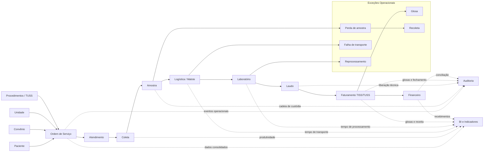

# Entrega 03 Corrigida - Integração Organizacional do ERP LabVida

**Disciplina:** Sistemas de Informação e Tecnologias (SIT)  
**Projeto:** ERP LabVida - Laboratório de Análises Clínicas  
**Equipe:** Aline Fernanda Soares Silva · Clauderson Branco Xavier · Gustavo Ferreira Wanderley · Victor Alexandre Saraiva Pimentel  
**Garanhuns - PE · 2026**

---

## 1. Introdução

Esta é a versão corrigida da Entrega 03, revisada a partir do feedback do professor. O foco da correção foi reforçar a visão do LabVida como um ERP integrado, mostrando com mais clareza como os módulos se comunicam, como os eventos operacionais afetam outros setores, como a rastreabilidade se mantém ao longo do processo e como as regras organizacionais moldam o fluxo de informação.

As principais correções aplicadas foram:

- inclusão de um diagrama único com os módulos, a OS, os eventos e os impactos organizacionais;
- detalhamento da circulação dos dados desde o cadastro até o BI;
- explicitação das regras de negócio que conectam atendimento, coleta, laboratório, faturamento, financeiro e auditoria;
- inclusão de situações excepcionais como glosas, perda de amostras, recoletas, falhas de transporte e reprocessamento.

---

## 2. Visão Geral da Integração

No LabVida, a **Ordem de Serviço (OS)** é a entidade central da operação. Ela conecta o paciente, os procedimentos solicitados, a coleta, a logística, o processamento técnico, o faturamento, o financeiro e a análise gerencial.



Esse fluxo mostra que nenhum módulo opera de forma isolada. Cada etapa produz informação útil para os setores seguintes e também para a auditoria e o BI.

---

## 3. Módulos e Responsabilidades Integradas

| Módulo | Responsabilidade principal | Informações que recebe | Informações que produz |
|---|---|---|---|
| Cadastro | Manter dados de pacientes, profissionais, convênios, unidades e procedimentos | Dados administrativos e contratuais | Base única para atendimento, faturamento e BI |
| Atendimento e Coleta | Abrir OS, validar convênio, registrar exames e coletar amostras | Paciente, convênio, procedimento e unidade | OS, itens de OS, amostra e evento de coleta |
| Logística de Amostras | Transportar amostras entre unidades e laboratório central | Amostras coletadas e origem | Malote, movimentações e protocolo de recebimento |
| Laboratório | Processar exames, revisar resultados e liberar laudos | Amostras recebidas e procedimentos | Resultado, revisão técnica e laudo liberado |
| Faturamento | Gerar guias, lotes, XML TISS e controlar glosas | Laudos liberados, convênio e valores contratados | Guia TISS, lote e glosa |
| Financeiro | Controlar contas a receber, conciliação e caixa | Lotes fechados e pagamentos | Títulos, baixas e divergências |
| Auditoria | Registrar eventos sensíveis e ações críticas | Alterações operacionais e acessos | Trilha de auditoria institucional |
| BI | Consolidar dados para apoio à decisão | Eventos de todos os módulos | Indicadores, painéis e relatórios gerenciais |

---

## 4. Comunicação Entre Módulos

A comunicação ocorre por base de dados integrada e por eventos operacionais. A base garante consistência; os eventos propagam impactos para os demais setores.

| Evento operacional | Origem | Destino(s) | Efeito organizacional |
|---|---|---|---|
| Paciente cadastrado | Cadastro | Atendimento | Paciente fica disponível para abertura de OS |
| OS aberta | Atendimento | Coleta, Faturamento, BI | Exames passam a existir como demanda operacional |
| Convênio validado | Atendimento | Faturamento | Guia e autorização entram no fluxo TISS |
| Coleta registrada | Coleta | Logística, BI, Auditoria | Amostra entra na cadeia de custódia |
| Amostra enviada em malote | Logística | Laboratório | Laboratório recebe previsão de processamento |
| Amostra recebida | Logística | Laboratório | Exame é liberado para execução técnica |
| Resultado importado | Laboratório | Auditoria | Resultado fica rastreável e revisável |
| Laudo liberado | Laboratório | Faturamento, BI | Item passa a ser elegível para cobrança |
| Lote fechado | Faturamento | Financeiro, BI | Título a receber é gerado |
| Pagamento conciliado | Financeiro | BI, Gestão | Receita, divergências e inadimplência são atualizadas |

---

## 5. Fluxo Ponta a Ponta da Informação

### 5.1 Entrada da informação

O processo começa no Cadastro e no Atendimento. Paciente, convênio, profissional solicitante, procedimento e unidade são selecionados a partir de cadastros únicos. A OS concentra a demanda e evita digitação repetida.

### 5.2 Processamento operacional

A OS gera amostras identificadas, e a coleta registra quem coletou, quando coletou e a qual OS a amostra pertence. Em seguida, a logística controla o transporte em malotes e registra o recebimento no laboratório central.

### 5.3 Processamento técnico

Após o recebimento, o laboratório executa o exame, revisa o resultado e libera o laudo. O laudo só é válido quando assinado pelo responsável técnico.

### 5.4 Processamento administrativo e financeiro

Com o laudo liberado, o faturamento cria ou habilita o item faturável, fecha o lote e encaminha o título ao financeiro. Eventuais glosas retornam como divergências para correção e análise.

### 5.5 Processamento analítico

Todos os eventos alimentam o BI, permitindo acompanhar produtividade, tempo de ciclo, receita, glosas, volume de exames e desempenho por unidade.

---

## 6. Rastreabilidade Organizacional

A rastreabilidade permite reconstruir o caminho da informação e identificar quem realizou cada ação, quando ela ocorreu e qual entidade foi afetada.

| Objeto rastreado | Como é rastreado | Finalidade |
|---|---|---|
| OS | Código único e histórico de status | Acompanhar o ciclo do atendimento |
| Amostra | Código de barras/QR e movimentações | Garantir cadeia de custódia |
| Malote | Origem, destino, responsável e recebimento | Controlar transporte entre unidades |
| Resultado | Status, equipamento, revisão e alterações | Preservar confiabilidade técnica |
| Laudo | Responsável técnico, assinatura e data | Comprovar validade clínica |
| Guia TISS | Número, lote, item e laudo associado | Rastrear cobrança ao convênio |
| Título financeiro | Lote de origem, valor, vencimento e baixa | Rastrear receita ou obrigação |
| Auditoria | Usuário, ação, data/hora e dados alterados | Garantir governança e controle interno |

Encadeamento resumido:

```text
Paciente -> OS -> Item da OS -> Amostra -> Coleta -> Malote -> Recebimento -> Resultado -> Laudo -> Guia TISS -> Lote -> Título -> Conciliação -> BI
```

---

## 7. Circulação dos Dados

| Fase | Dados principais | Módulo responsável | Resultado |
|---|---|---|---|
| Entrada cadastral | Paciente, profissional, convênio, procedimento, unidade | Cadastro | Dados padronizados |
| Solicitação | OS, itens da OS, autorização | Atendimento | Demanda formal de exames |
| Identificação física | Amostra, etiqueta, coletor | Coleta | Material biológico vinculado à OS |
| Transporte | Malote, movimentações, recebimento | Logística | Cadeia de custódia documentada |
| Análise | Resultado, equipamento, valores de referência | Laboratório | Resultado técnico validável |
| Validação | Revisão, laudo, assinatura | Laboratório | Laudo liberado |
| Cobrança | Guia TISS, itens, lote | Faturamento | Receita faturada por convênio |
| Controle econômico | Título, baixa, conciliação | Financeiro | Receita recebida ou pendente |
| Análise gerencial | Fatos, dimensões e indicadores | BI | Apoio à decisão |

---

## 8. Regras de Negócio

| Regra de negócio | Módulos envolvidos | Impacto no processo |
|---|---|---|
| Paciente deve ter identificação única | Cadastro, Atendimento | Evita duplicidade de OS |
| Convênio deve estar ativo para autorizar atendimento | Cadastro, Atendimento, Faturamento | Impede atendimento indevido |
| Procedimento deve existir no catálogo TUSS | Cadastro, Atendimento, Faturamento | Garante cobrança padronizada |
| OS deve possuir código único | Atendimento, Coleta, Laboratório, Faturamento | Permite rastrear o ciclo completo |
| Amostra deve estar vinculada a uma OS | Coleta, Logística, Laboratório | Evita amostra sem origem |
| Amostra só pode ser processada após recebimento | Logística, Laboratório | Protege a cadeia de custódia |
| Resultado alterado deve gerar auditoria | Laboratório, Auditoria | Preserva histórico clínico |
| Laudo só pode ser liberado por responsável técnico | Laboratório, Auditoria | Garante responsabilidade técnica |
| Laudo liberado habilita faturamento | Laboratório, Faturamento | Impede cobrança antecipada |
| Lote fechado gera título a receber | Faturamento, Financeiro | Integra cobrança e controle financeiro |
| Compra aprovada gera título a pagar | Compras, Financeiro | Integra suprimentos e contas a pagar |
| BI deve usar dados consolidados e anonimizados | BI, Cadastro, Atendimento | Evita exposição indevida de dados sensíveis |

---

## 9. Situações Excepcionais

O feedback do professor apontou a necessidade de explicitar cenários fora do fluxo ideal. Esses casos também fazem parte da integração do ERP.

| Situação excepcional | Efeito no sistema | Módulos impactados |
|---|---|---|
| Glosa | Item ou guia é recusado total ou parcialmente pelo convênio | Faturamento, Financeiro, BI |
| Perda de amostra | A amostra é inutilizada e perde a condição de análise | Coleta, Logística, Laboratório, Auditoria |
| Recoleta | Nova amostra precisa ser gerada para substituir a perdida ou inadequada | Atendimento, Coleta, Auditoria |
| Falha de transporte | Malote chega com atraso, divergência ou violação | Logística, Laboratório, Auditoria |
| Reprocessamento | Exame precisa ser repetido por falha técnica, qualidade ou inconsistência | Laboratório, Auditoria, BI |

Tratamento resumido:

- Glosas retornam ao faturamento para análise de motivo, correção e reenvio, quando aplicável.
- Perda de amostra gera bloqueio operacional e necessidade de recoleta.
- Falhas de transporte interrompem a cadeia de custódia até a validação da ocorrência.
- Reprocessamentos permanecem vinculados ao mesmo ciclo da OS para não perder rastreabilidade.
- Todos os casos excepcionais devem ser registrados em auditoria e refletidos no BI.

---

## 10. Consistência e Unicidade dos Dados

A integração organizacional depende de uma base única de dados.

Princípios adotados:

- a OS é a entidade-espinha do fluxo operacional;
- paciente, convênio, procedimento e unidade são referenciados por identificadores únicos;
- a amostra sempre está vinculada a uma OS;
- o laudo se conecta ao item da OS e ao responsável técnico;
- a guia TISS referencia o laudo liberado;
- o título financeiro referencia o lote de faturamento;
- a auditoria registra alterações sensíveis sem sobrescrever histórico;
- o BI consome dados consolidados, sem alterar a base operacional.

Com isso, o sistema assegura uma única versão da verdade para os setores da LabVida.

---

## 11. Indicadores Gerenciais Gerados Pela Integração

| Indicador | Dados de origem | Utilidade gerencial |
|---|---|---|
| Tempo médio entre coleta e laudo | Coleta, movimentação, resultado e laudo | Avaliar eficiência operacional |
| Produtividade por unidade | OS, coletas e laudos | Comparar desempenho entre unidades |
| Taxa de glosa por convênio | Guia TISS, itens e glosa | Melhorar contratos e reduzir perdas |
| Receita por procedimento | Procedimento, guia item e título a receber | Avaliar rentabilidade de exames |
| Inadimplência e divergências | Título a receber e conciliação | Apoiar controle financeiro |
| Consumo de insumos por setor | Estoque, compras e laboratório | Planejar compras e evitar ruptura |
| Volume de exames por período | OS item, procedimento e tempo | Prever demanda e escala |
| Ocorrências de auditoria | Auditoria corporativa e usuários | Monitorar riscos e conformidade |

---

## 12. Conclusão

A versão corrigida reforça que o LabVida funciona como um ERP integrado e não como módulos isolados. A OS permanece como o eixo de ligação entre os setores, a rastreabilidade é mantida do paciente ao financeiro e o BI consolida os impactos operacionais para a gestão. A inclusão do diagrama único e das situações excepcionais torna a documentação mais alinhada ao feedback do professor e mais fiel à realidade organizacional do laboratório.
